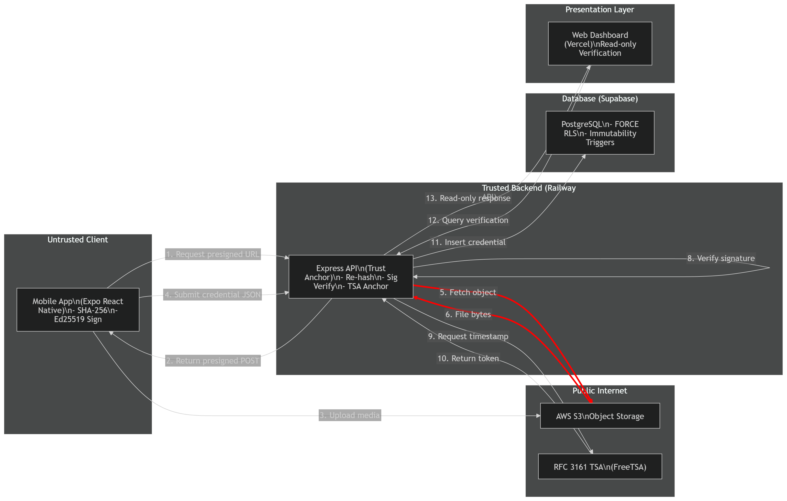

# ProofLens

### Capture proof. Verify independently.

[](https://github.com/zainalibutt/Proof-Lens/actions/workflows/ci.yml)
[](https://github.com/zainalibutt/Proof-Lens/actions/workflows/codeql.yml)
[](https://github.com/zainalibutt/Proof-Lens/actions/workflows/secret-scan.yml)
[](LICENSE)

ProofLens is a full-stack media-provenance research prototype spanning an Expo mobile
capture client, an Express API, a React verification dashboard, PostgreSQL and AWS S3.
It preserves a cryptographically checkable record of a photo or audio file from capture
through independent timestamping and portable offline verification.

The project received **83/100** as a BSc Computer Science final-year project, including
**100/100 for the viva**. It is presented here as evidence of product engineering,
security-conscious architecture and honest technical evaluation—not as a forensic or
legal product.

[**Open the live product**](https://proof-lens.vercel.app) ·
[**Install the Android preview**](https://proof-lens.vercel.app/capture) ·
[**Verify the sample bundle**](docs/captureevidencebundle) ·
[**Read the architecture**](docs/ARCHITECTURE.md)

> **Status: technically credible academic prototype.** ProofLens is not independently
> audited, forensically validated or suitable for legal/evidentiary use. Its claims and
> limitations are deliberately bounded below and in [THREAT_MODEL.md](THREAT_MODEL.md).

## At a glance

| | |
|---|---|
| **Product** | Mobile capture, web evidence library, file verification, revocable shares and offline evidence bundles |
| **System** | React Native/Expo → Express/TypeScript → S3 + Supabase/PostgreSQL → RFC 3161 TSA → React/Vite |
| **Scale built** | Approximately 14,573 authored lines, 35 API endpoints and ten application tables |
| **Evaluation** | 36 named checks; all 124 credentials submitted after TSA integration anchored successfully |
| **Measured path** | 9.6-second mean immediate capture-to-anchor latency under the reported test conditions |
| **Delivery** | Live web app, deployed API and installable Android preview, backed by CI and security scanning |

## The product journey

```text
Capture → Hash → Sign → Upload → Re-hash → Timestamp → Inspect or verify
 mobile                object       API         TSA          web / offline
```

1. **Capture on mobile.** ProofLens records a photo, burst or audio file and calculates
   its SHA-256 digest on the device.
2. **Bind it to a device key.** A device-held Ed25519 key signs the 32-byte digest before
   upload.
3. **Verify what arrived.** The API streams the stored object back from S3 and independently
   recomputes SHA-256 instead of trusting the client-reported value.
4. **Anchor it in time.** The matching digest is submitted to an RFC 3161 timestamp
   authority and the DER response is stored alongside the credential.
5. **Inspect or take it away.** The web product presents the record in an evidence library,
   while a portable bundle can reproduce the checks offline with OpenSSL.



## Why I built it

Digital files are easy to duplicate and alter, while ordinary metadata is easy to strip
or rewrite. ProofLens explores a narrower, testable question:

> Can a mobile capture produce a portable record that lets another person independently
> check the file bytes, the signing key and an external time anchor?

The answer is intentionally bounded. ProofLens does not try to decide whether an image is
“true”. It makes the provenance claim inspectable and reproducible, then states where that
claim stops.

## Product surfaces

### Mobile capture

- Installable Android preview with device registration and protected key storage
- Photo, burst and audio capture
- Automatic hashing, signing, upload and timestamp submission
- Offline queue for up to ten files, with retry and recovery paths
- Deep-link handoff from the web product

### Evidence library

- Thumbnail-first media browsing with date grouping and search
- Fixed evidence inspector: media preview, hashes, signature state and trusted time
- Session views for burst captures and separate audio records
- Original-media, timestamp and portable-bundle downloads
- Time-limited, revocable evidence sharing

### Independent verification

- In-browser verification against a stored credential
- Portable bundle containing the media, digest, signature, public key, TSA artefacts and
  certificate chain
- Cross-platform `verify.sh` and `verify.ps1` scripts using standard OpenSSL

## Engineering decisions that matter

### Never trust the client-reported hash

The server re-fetches the uploaded object from S3 and streams a fresh SHA-256 digest. A
malicious or faulty client that reports a digest for different bytes fails closed before a
credential is persisted.

### Keep cloud credentials off the device

The mobile client receives a short-lived presigned POST target with a namespace and file-size
policy. Long-lived AWS credentials remain server-side and are supplied through deployment
environment variables.

### Make verification portable

The evidence bundle is not a screenshot of a green status badge. It contains the artefacts
needed to rerun the integrity, signature and timestamp checks without the live ProofLens
service.

### Treat the database as a security boundary

Application tables use server-only writes, revoked browser-role privileges, FORCE RLS,
owner-consistency constraints, immutability triggers and audit logging. A rollback-based
two-tenant regression test exercises the cross-owner boundary.

### Degrade explicitly

If the timestamp authority is unavailable, ProofLens retains a submitted state instead of
pretending the evidence is anchored. Queueing, retry states and visible verification status
make partial failure inspectable.

## What the checks establish

| Check | Bounded claim |
|---|---|
| **SHA-256 integrity** | The examined bytes match the bytes represented by the recorded digest. |
| **Ed25519 signature** | The registered application key corresponding to the public key signed that digest. |
| **RFC 3161 timestamp** | The digest existed no later than the independent TSA timestamp. |
| **Offline bundle** | Those checks can be reproduced with the bundled artefacts and OpenSSL, without the live app. |

## What ProofLens does not establish

- It does **not** prove that a depicted scene was truthful, unstaged or free from synthetic
  content introduced before signing.
- A client-reported capture time is not an independently anchored time. Only the TSA token
  provides the external time claim.
- Expo SecureStore is protected application storage, not hardware-backed remote attestation.
- The system does not defeat a compromised operating system, malicious application build,
  screen recapture or a compromised trusted backend.
- It makes no claim to legal admissibility, forensic-grade capture, hardware identity or
  production readiness.

The trusted computing base and attack analysis are documented in
[THREAT_MODEL.md](THREAT_MODEL.md).

## Evaluation evidence

The academic evaluation covered functional, cryptographic, failure and architecture paths.
The figures below describe the reported test environment, not internet-scale production
performance.

| Evidence | Result |
|---|---|
| Named evaluation checks | 36, plus seven architectural investigations |
| Post-TSA credentials | 124/124 anchored in the evaluated dataset |
| Immediate capture-to-anchor latency | 9.6-second mean under tested conditions |
| Device coverage | Two iPhones; no broad device matrix |
| Verification independence | Integrity, signature and timestamp reproduced from a bundle with OpenSSL |
| Additional delivered scope | Audio, burst-frame signing, portable bundles and token-hash share links |

The project was evaluated by its author. It did not include an independent security audit,
hostile load test, multi-author study, forensic/legal validation or multi-TSA resilience.

## Security hardening

The public-release review addressed the implementation-level findings below without
inflating the underlying research claim.

| Area | Current state |
|---|---|
| S3 object keys | Server-generated per-user namespaces with 128 bits of entropy; presigned policy pins namespace and size range |
| Secret separation | Dedicated bundle HMAC secret, required length, no Supabase-key fallback and fail-closed startup validation |
| Logs | Query strings redacted; audit user agents capped; IPs derived through bounded proxy trust |
| API boundary | Helmet/CSP, restricted CORS and authenticated rate-limit identity |
| Database | Server-only application access, FORCE RLS, immutable evidence records and tested owner-consistency constraints |
| Sharing | Configured public origin plus expiry-bound, revocable, HMAC-signed links stored by token hash |
| Supply chain | CI, CodeQL, dependency review, Dependabot and full-history Gitleaks scanning |

The deployed hardening migration and regression test are available at
[`database/migrations/001_lock_down_evidence_writes.sql`](database/migrations/001_lock_down_evidence_writes.sql)
and [`database/tests/cross_tenant_isolation_test.sql`](database/tests/cross_tenant_isolation_test.sql).

## Try the offline proof

The repository includes a privacy-reviewed sample bundle produced by the running system.
It contains a deliberately featureless test image with no people or GPS metadata.

```bash
git clone https://github.com/zainalibutt/Proof-Lens.git
cd Proof-Lens/docs/captureevidencebundle
./verify.sh
```

On Windows PowerShell, run `./verify.ps1`. Both paths require OpenSSL on `PATH` and verify
the media digest, detached Ed25519 signature and RFC 3161 timestamp response.

## Technology

| Layer | Stack |
|---|---|
| Mobile | Expo SDK 57, React Native, TypeScript, SecureStore, TweetNaCl |
| API | Node.js, Express, TypeScript, AWS SDK v3, OpenSSL, Zod |
| Web | React, Vite, TypeScript, React Router |
| Data | Supabase / PostgreSQL, Auth, RLS and database triggers |
| Storage | AWS S3 with presigned upload and download flows |
| Delivery | Railway, Vercel, EAS Build and GitHub Actions |

## Repository map

```text
mobile/            Expo app — capture, hashing, signing, offline queue and upload
prooflens-api/     Express API — devices, storage, verification, TSA, shares and bundles
web/               React dashboard — evidence library, verification and share portal
database/          PostgreSQL schema, migrations, tests and least-privilege IAM template
docs/              Architecture, verification guide, timeline and sample evidence bundle
```

## Run locally

ProofLens targets Node.js 24.13.0 (see `.nvmrc`) and requires OpenSSL for timestamp flows.

```bash
cd prooflens-api && npm install && cp .env.example .env && npm run dev
cd web           && npm install && cp .env.example .env && npm run dev
cd mobile        && npm install && cp .env.example .env && npx expo start --clear --lan
```

The example environment files contain placeholders only. Supply your own Supabase project,
S3 bucket and least-privilege IAM identity; never place cloud credentials in the mobile or
web client. Detailed setup is in [`database/setup.md`](database/setup.md).

## Documentation

- [Architecture and trust boundaries](docs/ARCHITECTURE.md)
- [Verification guide](docs/VERIFICATION.md)
- [Threat model](THREAT_MODEL.md)
- [Security policy](SECURITY.md)
- [Academic assessment walkthrough](docs/ACADEMIC_DEMO.md)
- [Development and investigation timeline](docs/PROJECT_TIMELINE.md)

## Related work

ProofLens is one of a pair. [**Melody Terminal**](https://github.com/zainalibutt/Melody)
applies the same idea to market data: a command-driven research terminal where every
number states which provider answered, how stale it is, and when a fallback stood in for
the preferred source.

Both projects are about being honest regarding the limits of your own evidence. ProofLens
makes a file's origin inspectable; Melody makes a number's origin inspectable. Neither
claims more than it can demonstrate.

## Project context

ProofLens was designed and built by [Zain Butt](https://www.linkedin.com/in/zain-butt-dev)
between January and April 2026 for a BSc Computer Science final-year project at City St
George's, University of London. The public repository starts from a reviewed, sanitised
release snapshot; the documented timeline preserves the authentic development and
investigation story without republishing private artefacts.

Released under the [MIT Licence](LICENSE).
