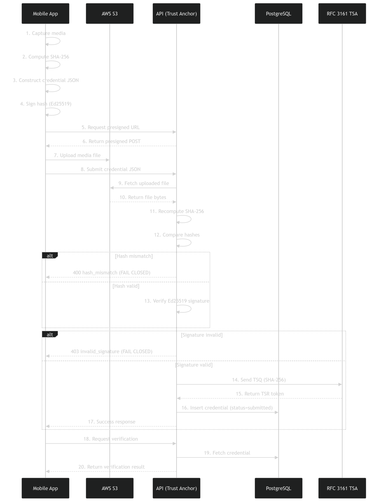

# Architecture


## Components

| Component | Technology | Responsibility |
|---|---|---|
| **Mobile** | Expo / React Native / TypeScript | Capture photo and audio, compute SHA-256 on-device, hold the Ed25519 keypair, sign digests, queue uploads for offline resilience, upload directly to S3 |
| **API** | Node.js / Express / TypeScript | Device registration, signature verification, authoritative S3 re-hash, RFC 3161 anchoring, share links, evidence-bundle assembly |
| **Web** | React / Vite / TypeScript | Evidence dashboard, in-app verification, public share portal |
| **Database** | Supabase / PostgreSQL | Server-only application data path; FORCE RLS, composite owner constraints, evidence immutability triggers and audit logs |
| **Storage** | AWS S3 | Media objects and TSA response sidecars |

## API surface

```
src/routes/
  captures.ts     Capture credential submission and retrieval
  credentials.ts  Credential creation, listing, signature verification
  devices.ts      Device registration and public-key management
  media.ts        Presigned upload targets, media access
  verify.ts       Verification endpoints
  shares.ts       Share-link creation, resolution, revocation
  drafts.ts       In-progress capture drafts
  audio.ts        Audio-specific capture flows
  bursts.ts       Multi-frame burst captures
  health.ts       Liveness

src/services/
  device.ts       Device registration, key lookup, upload auditing
  evidence.ts     Evidence assembly and bundle construction

src/utils/
  crypto.ts       Ed25519 verification, HMAC bundle/share tokens
  s3.ts           Presigned URLs, streaming re-hash, TSA sidecar upload
  validation.ts   Zod request schemas
  rateLimit.ts    Write-path rate limiting
```

## Capture pipeline

```
┌──────────┐   1. capture
│  Mobile  │   2. SHA-256 over file bytes
│          │   3. Ed25519 detached signature over the 32-byte digest
└────┬─────┘
     │ 4. request presigned POST target
     ▼
┌──────────┐
│   API    │──── issues short-lived, scoped presigned POST ────┐
└────┬─────┘                                                   │
     │                                                         ▼
     │                                              ┌──────────────────┐
     │                          5. direct upload ──►│      AWS S3      │
     │                                              └────────┬─────────┘
     │ 6. submit credential (digest, signature, device id)    │
     ▼                                                        │
┌──────────┐   7. re-fetch object and stream an independent  │
│   API    │◄─────────── SHA-256 ────────────────────────────┘
│          │   8. compare against client-reported digest
│          │   9. verify Ed25519 signature against the registered public key
│          │  10. submit digest to RFC 3161 TSA, store DER response as sidecar
└────┬─────┘
     │ 11. persist credential (immutable)
     ▼
┌──────────┐
│ Postgres │
└──────────┘
```

Step 7 is the security-critical one. The server never accepts the client's hash claim: it
independently hashes whatever actually landed in S3. A device that reports a digest which
does not match the stored object fails verification.

## Credential pipeline



## Key management

- The Ed25519 keypair is generated at first launch and stored in `expo-secure-store`
  (`prooflens_keypair_v1`), backed by iOS Keychain / Android Keystore.
- The public key is registered against an authenticated user–device pair; the private key
  never leaves the device.
- Registration metadata is cached to avoid redundant re-registration.
- Signing uses TweetNaCl: `nacl.sign.detached(sha256Bytes, secretKey)`; the API verifies
  with `nacl.sign.detached.verify(sha256Bytes, sig, pub)`.

> This is protected application storage, **not** hardware attestation. See
> [../THREAT_MODEL.md](../THREAT_MODEL.md) §2.2.

## RFC 3161 anchoring

Timestamp queries are constructed via OpenSSL:

```
openssl ts -query -digest <sha256hex> -sha256 -cert -no_nonce
```

`-no_nonce` is deliberate: it makes the query deterministically reconstructable from the
digest alone, so an evidence bundle can be verified later without retaining per-request
state. The DER-encoded response is stored as an S3 sidecar and shipped in bundles.

If `TSA_URL` is unset, anchoring is skipped and credentials persist in a submitted rather
than anchored state — the system stays functional, without an independent time bound.

## Data-layer controls

- Row-level security on every table; the `anon` key can only reach the authenticated
  user's own rows.
- The `service_role` key is server-side only and never shipped to any client.
- Immutability triggers on evidence tables prevent retroactive edits.
- Append-only audit log for uploads and verification events.

## Token design

Both share links and evidence-bundle downloads use HMAC-signed payloads carrying a version,
the digest, a hash of the share token, an expiry, and a nonce — time-limited and
individually revocable. Payloads are strictly validated before use (digest shape, ISO
expiry, minimum nonce length).

## Deployment

| Service | Platform | Notes |
|---|---|---|
| API | Railway | Root directory `prooflens-api` |
| Web | Vercel | Static build from `web` |
| Database | Supabase | Schema in `database/schema_clean.sql` |
| Storage | AWS S3 | IAM scoped per `database/iam_policy.json` |
